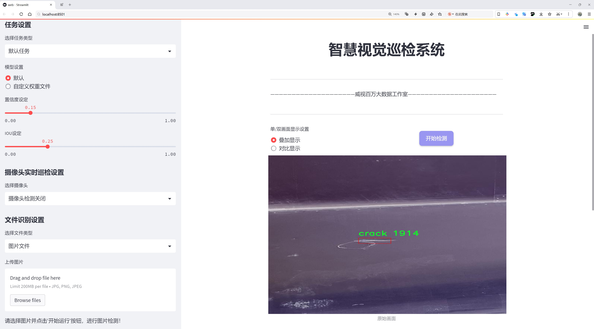
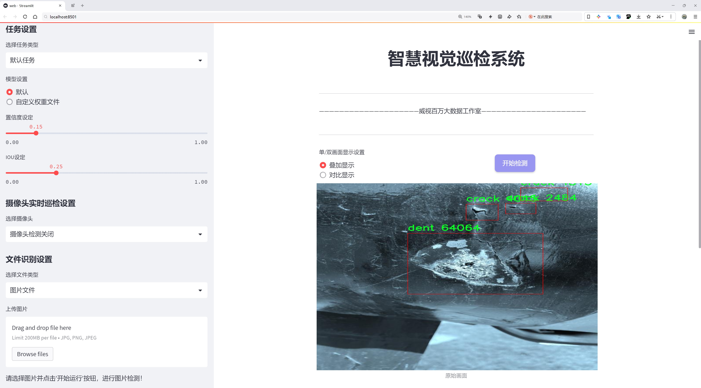
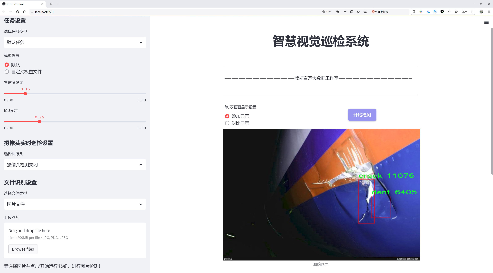
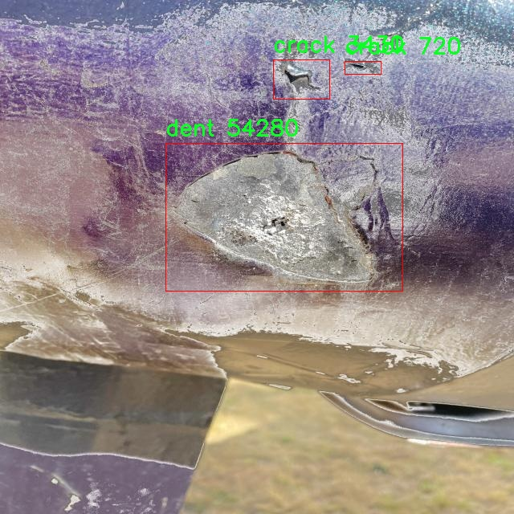
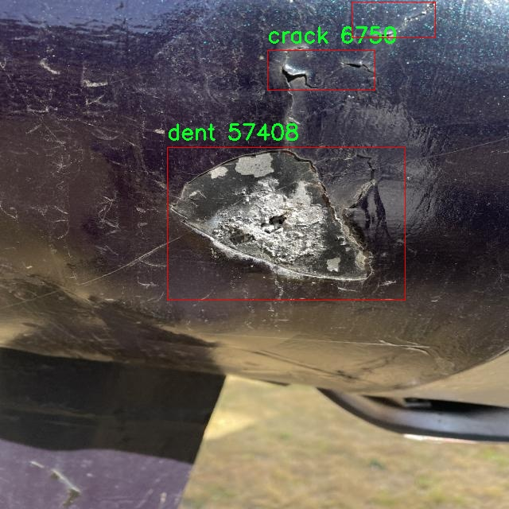
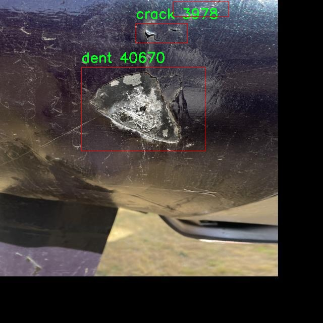
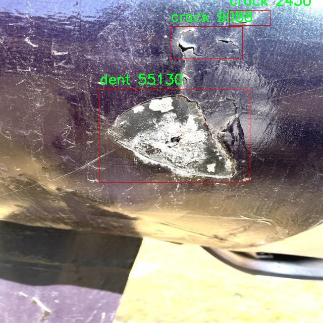
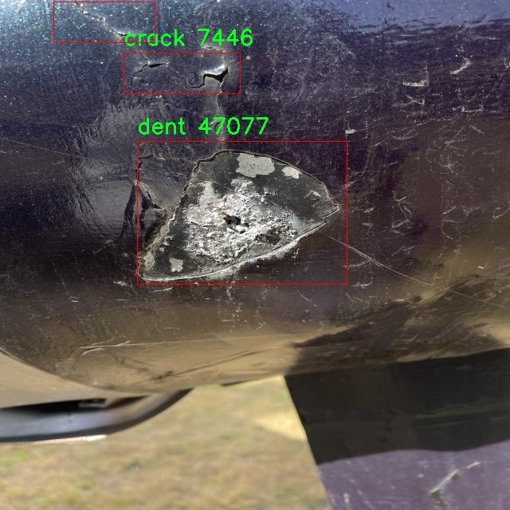

# 飞机表面缺陷检测检测系统源码分享
 # [一条龙教学YOLOV8标注好的数据集一键训练_70+全套改进创新点发刊_Web前端展示]

### 1.研究背景与意义

项目参考[AAAI Association for the Advancement of Artificial Intelligence](https://gitee.com/qunshansj/projects)

项目来源[AACV Association for the Advancement of Computer Vision](https://gitee.com/qunmasj/projects)

研究背景与意义

随着航空工业的迅猛发展，飞机的安全性和可靠性愈发受到重视。飞机在其服役期间，表面可能会受到多种因素的影响而出现缺陷，如裂纹、凹陷、缺失的螺钉头、涂层脱落和划痕等。这些缺陷不仅会影响飞机的外观，更重要的是可能对飞机的结构完整性和飞行安全构成威胁。因此，及时、准确地检测和评估飞机表面缺陷，成为了航空维修和安全管理中的一项重要任务。

传统的飞机表面缺陷检测方法多依赖于人工视觉检查和经验判断，这种方法不仅效率低下，而且容易受到人为因素的影响，导致漏检或误判。随着计算机视觉和深度学习技术的快速发展，基于自动化检测的解决方案逐渐成为研究的热点。YOLO（You Only Look Once）系列模型以其高效的实时目标检测能力，逐渐被应用于各类工业检测任务中。YOLOv8作为该系列的最新版本，具备更强的特征提取能力和更高的检测精度，能够在复杂环境中快速识别多种类型的缺陷。

本研究旨在基于改进的YOLOv8模型，构建一个高效的飞机表面缺陷检测系统。为此，我们将使用“创新机库v2”数据集，该数据集包含4288张飞机表面图像，涵盖了五类缺陷：裂纹、凹陷、缺失的螺钉头、涂层脱落和划痕。这些数据的多样性和丰富性为模型的训练和测试提供了坚实的基础，使得模型能够在实际应用中更好地适应不同的检测场景。

通过对YOLOv8模型的改进，我们期望在检测精度和速度上实现显著提升。具体而言，改进的方向包括优化网络结构、增强数据预处理和后处理技术，以及引入迁移学习等策略，以提高模型在特定缺陷类型上的表现。此外，我们还将探索模型在不同光照、角度和背景下的鲁棒性，以确保其在实际应用中的可靠性。

本研究的意义不仅在于提升飞机表面缺陷检测的自动化水平，更在于为航空安全提供一种新的技术手段。通过实现高效、准确的缺陷检测，能够有效降低人工检查的工作量，减少人为错误，提高检测的及时性和准确性，从而为飞机的安全运营提供保障。此外，研究成果还可以推广到其他领域的物体检测任务中，具有广泛的应用前景。

综上所述，基于改进YOLOv8的飞机表面缺陷检测系统的研究，不仅具有重要的理论价值，也具有显著的实际应用意义。通过深入探讨和实践，我们希望能够为航空工业的安全管理提供新的解决方案，推动智能检测技术的发展与应用。

### 2.图片演示







##### 注意：由于此博客编辑较早，上面“2.图片演示”和“3.视频演示”展示的系统图片或者视频可能为老版本，新版本在老版本的基础上升级如下：（实际效果以升级的新版本为准）

  （1）适配了YOLOV8的“目标检测”模型和“实例分割”模型，通过加载相应的权重（.pt）文件即可自适应加载模型。

  （2）支持“图片识别”、“视频识别”、“摄像头实时识别”三种识别模式。

  （3）支持“图片识别”、“视频识别”、“摄像头实时识别”三种识别结果保存导出，解决手动导出（容易卡顿出现爆内存）存在的问题，识别完自动保存结果并导出到tempDir中。

  （4）支持Web前端系统中的标题、背景图等自定义修改，后面提供修改教程。

  另外本项目提供训练的数据集和训练教程,暂不提供权重文件（best.pt）,需要您按照教程进行训练后实现图片演示和Web前端界面演示的效果。

### 3.视频演示

[3.1 视频演示](https://www.bilibili.com/video/BV1Mzt5eDEbk/)

### 4.数据集信息展示

##### 4.1 本项目数据集详细数据（类别数＆类别名）

nc: 5
names: ['crack', 'dent', 'missing-head', 'paint-off', 'scratch']


##### 4.2 本项目数据集信息介绍

数据集信息展示

在现代航空工业中，飞机表面缺陷的检测与识别至关重要。为此，我们采用了名为“Innovation Hangar v2”的数据集，以改进YOLOv8模型在飞机表面缺陷检测系统中的表现。该数据集专门针对飞机表面缺陷的多样性与复杂性进行了精心设计，涵盖了五种主要的缺陷类别，分别是裂纹（crack）、凹陷（dent）、缺失的螺栓头（missing-head）、漆面剥落（paint-off）和划痕（scratch）。这些类别不仅反映了飞机表面可能出现的实际问题，也为模型的训练提供了丰富的样本和多样化的场景。

在数据集的构建过程中，研究团队收集了大量真实世界的飞机表面图像，这些图像来自于不同的飞机型号和不同的环境条件。通过精确标注和分类，数据集确保了每一张图像都能准确反映出相应的缺陷类型。这种高质量的标注为YOLOv8模型的训练提供了坚实的基础，使其能够更好地学习到不同缺陷的特征和表现形式。

具体而言，裂纹（crack）类别的图像展示了飞机表面材料在承受压力或疲劳后所产生的细微裂缝，这些裂缝可能会随着时间的推移而扩大，导致严重的安全隐患。凹陷（dent）则通常是由于外部撞击或碰撞造成的，可能影响飞机的气动性能。缺失的螺栓头（missing-head）类别则强调了飞机维护过程中可能出现的失误，任何一个小细节的疏忽都可能导致飞行安全的重大隐患。漆面剥落（paint-off）不仅影响飞机的外观，也可能暴露出底层材料，增加腐蚀的风险。而划痕（scratch）则可能是由于操作不当或外部环境造成的，这些划痕虽然看似微小，但在某些情况下也可能影响飞机的结构完整性。

为了确保数据集的全面性和代表性，研究团队在不同的光照条件、拍摄角度和背景环境下采集了图像。这种多样化的样本使得YOLOv8模型在训练过程中能够接触到更广泛的缺陷表现形式，从而提高其在实际应用中的鲁棒性和准确性。此外，数据集还包含了不同程度的缺陷表现，以便模型能够学习到从轻微到严重的各种缺陷特征。

在训练过程中，采用了数据增强技术，如旋转、缩放、翻转等，进一步丰富了数据集的多样性。这不仅提高了模型的泛化能力，也使得模型在面对未见过的缺陷时能够保持较高的检测准确率。通过对“Innovation Hangar v2”数据集的深入分析与应用，我们期望能够显著提升YOLOv8在飞机表面缺陷检测中的性能，为航空安全提供更为可靠的技术支持。

总之，“Innovation Hangar v2”数据集的设计与应用，充分体现了在航空领域中，数据驱动技术的重要性。通过精确的缺陷分类与丰富的样本，结合先进的YOLOv8模型，我们有望实现对飞机表面缺陷的高效、准确检测，为航空安全保驾护航。











### 5.全套项目环境部署视频教程（零基础手把手教学）

[5.1 环境部署教程链接（零基础手把手教学）](https://www.ixigua.com/7404473917358506534?logTag=c807d0cbc21c0ef59de5)


[5.2 安装Python虚拟环境创建和依赖库安装视频教程链接（零基础手把手教学）](https://www.ixigua.com/7404474678003106304?logTag=1f1041108cd1f708b01a)

### 6.手把手YOLOV8训练视频教程（零基础小白有手就能学会）

[6.1 手把手YOLOV8训练视频教程（零基础小白有手就能学会）](https://www.ixigua.com/7404477157818401292?logTag=d31a2dfd1983c9668658)

### 7.70+种全套YOLOV8创新点代码加载调参视频教程（一键加载写好的改进模型的配置文件）

[7.1 70+种全套YOLOV8创新点代码加载调参视频教程（一键加载写好的改进模型的配置文件）](https://www.ixigua.com/7404478314661806627?logTag=29066f8288e3f4eea3a4)

### 8.70+种全套YOLOV8创新点原理讲解（非科班也可以轻松写刊发刊，V10版本正在科研待更新）

由于篇幅限制，每个创新点的具体原理讲解就不一一展开，具体见下列网址中的创新点对应子项目的技术原理博客网址【Blog】：


[8.1 70+种全套YOLOV8创新点原理讲解链接](https://gitee.com/qunmasj/good)

### 9.系统功能展示（检测对象为举例，实际内容以本项目数据集为准）

图9.1.系统支持检测结果表格显示

  图9.2.系统支持置信度和IOU阈值手动调节

  图9.3.系统支持自定义加载权重文件best.pt(需要你通过步骤5中训练获得)

  图9.4.系统支持摄像头实时识别

  图9.5.系统支持图片识别

  图9.6.系统支持视频识别

  图9.7.系统支持识别结果文件自动保存

  图9.8.系统支持Excel导出检测结果数据


### 10.原始YOLOV8算法原理

原始YOLOv8算法原理

YOLOv8算法作为YOLO系列的最新版本，标志着目标检测领域的一次重要进步。它不仅在检测精度和速度上表现出色，还在模型结构和训练策略上进行了多项创新，极大地提升了模型的性能。YOLOv8的设计理念依然遵循了单阶段检测的原则，旨在实现实时目标检测的需求，同时保持高效的计算性能。

YOLOv8的网络结构可以分为四个主要部分：输入层、Backbone骨干网络、Neck特征融合网络和Head检测模块。输入层负责对输入图像进行预处理，包括调整图像比例、进行Mosaic增强以及计算瞄点。这样的预处理步骤为后续的特征提取和目标检测奠定了基础。YOLOv8在输入层的设计上也进行了优化，以确保在不同场景下都能有效处理图像数据。

在Backbone部分，YOLOv8采用了DarkNet结构的改进版本，使用了C2f模块替代了传统的C3模块。C2f模块通过引入更多的跳层连接和Split操作，增强了特征图的梯度流动能力，使得模型在提取特征时能够更好地保留重要信息，同时保持轻量级特性。这种设计使得YOLOv8在处理不同尺度的目标时，能够更有效地捕捉到细节信息，进而提升检测精度。

YOLOv8的Neck部分依然采用了“双塔结构”，结合了特征金字塔和路径聚合网络。这种结构促进了语义特征和定位特征的有效转移，使得模型在面对复杂场景时，能够更好地融合多层次的特征信息。通过这种特征融合，YOLOv8能够在不同尺度的目标检测中表现出色，尤其是在小目标和高分辨率图像的检测任务中，展现了其强大的能力。

在Head检测模块中，YOLOv8引入了新的解耦头结构，将分类和回归的任务分离开来。这一创新不仅加速了模型的收敛速度，还提升了检测的准确性。与传统的Anchor-Based方法不同，YOLOv8采用了Anchor-Free的检测策略，进一步简化了模型的结构，降低了计算复杂度。这样的设计使得YOLOv8在不同硬件平台上都能高效运行，从CPU到GPU均能保持良好的性能。

YOLOv8的创新还体现在损失函数的设计上。它采用了BCELoss作为分类损失，DFLLoss和CIoULoss作为回归损失，这种组合使得模型在训练过程中能够更好地优化分类和定位的精度。通过对损失函数的改进，YOLOv8在处理复杂场景时，能够更有效地降低误检和漏检的概率。

值得一提的是，YOLOv8在模型的规模上也进行了优化，提供了n、s、m、l、x五种不同尺度的模型，以满足不同应用场景的需求。每种模型在缩放系数的调整上并不是简单的线性变化，而是结合了主干网络的通道数进行综合考量，确保在不同规模下都能实现最佳性能。这种灵活的设计使得YOLOv8能够广泛应用于各类目标检测任务，从智能监控到自动驾驶，无不展现出其强大的适应性。

在训练策略方面，YOLOv8借鉴了YOLOv5和YOLOv6的成功经验，采用了动态Task-Aligned Assigner样本分配策略，并在训练的最后10个epoch中关闭了Mosaic增强。这些策略的调整使得模型在训练过程中能够更快地适应数据的变化，提高了训练效率和最终的检测效果。

总的来说，YOLOv8算法通过对网络结构的深度优化、创新的检测头设计以及灵活的模型规模选择，成功地在目标检测领域树立了新的标杆。它不仅在精度和速度上超越了前代模型，还在多种应用场景中展现了强大的性能，成为计算机视觉领域中一款不可或缺的工具。随着YOLOv8的广泛应用，未来的目标检测技术将更加智能化和高效化，为各行各业带来更大的便利和可能性。


### 11.项目核心源码讲解（再也不用担心看不懂代码逻辑）

#### 11.1 70+种YOLOv8算法改进源码大全和调试加载训练教程（非必要）\ultralytics\nn\backbone\VanillaNet.py

以下是对给定代码的核心部分进行分析和详细注释的结果。代码主要实现了一个卷积神经网络（VanillaNet），包含了多个模块和层，支持训练和推理两种模式。

```python
import torch
import torch.nn as nn
import torch.nn.functional as F
from timm.layers import weight_init

# 定义激活函数模块
class Activation(nn.ReLU):
    def __init__(self, dim, act_num=3, deploy=False):
        super(Activation, self).__init__()
        self.deploy = deploy  # 是否为推理模式
        # 初始化权重
        self.weight = torch.nn.Parameter(torch.randn(dim, 1, act_num*2 + 1, act_num*2 + 1))
        self.bias = None
        self.bn = nn.BatchNorm2d(dim, eps=1e-6)  # 批归一化
        self.dim = dim
        self.act_num = act_num
        weight_init.trunc_normal_(self.weight, std=.02)  # 权重初始化

    def forward(self, x):
        # 前向传播
        if self.deploy:
            return F.conv2d(
                super(Activation, self).forward(x), 
                self.weight, self.bias, padding=(self.act_num*2 + 1)//2, groups=self.dim)
        else:
            return self.bn(F.conv2d(
                super(Activation, self).forward(x),
                self.weight, padding=self.act_num, groups=self.dim))

    def switch_to_deploy(self):
        # 切换到推理模式
        if not self.deploy:
            kernel, bias = self._fuse_bn_tensor(self.weight, self.bn)
            self.weight.data = kernel
            self.bias = torch.nn.Parameter(torch.zeros(self.dim))
            self.bias.data = bias
            self.__delattr__('bn')  # 删除批归一化层
            self.deploy = True

# 定义基本块
class Block(nn.Module):
    def __init__(self, dim, dim_out, act_num=3, stride=2, deploy=False):
        super().__init__()
        self.deploy = deploy
        # 根据是否为推理模式选择不同的卷积层
        if self.deploy:
            self.conv = nn.Conv2d(dim, dim_out, kernel_size=1)
        else:
            self.conv1 = nn.Sequential(
                nn.Conv2d(dim, dim, kernel_size=1),
                nn.BatchNorm2d(dim, eps=1e-6),
            )
            self.conv2 = nn.Sequential(
                nn.Conv2d(dim, dim_out, kernel_size=1),
                nn.BatchNorm2d(dim_out, eps=1e-6)
            )
        # 池化层
        self.pool = nn.MaxPool2d(stride) if stride != 1 else nn.Identity()
        self.act = Activation(dim_out, act_num)  # 激活函数

    def forward(self, x):
        # 前向传播
        if self.deploy:
            x = self.conv(x)
        else:
            x = self.conv1(x)
            x = F.leaky_relu(x, negative_slope=1)  # 使用Leaky ReLU激活
            x = self.conv2(x)

        x = self.pool(x)  # 池化
        x = self.act(x)  # 激活
        return x

# 定义VanillaNet网络结构
class VanillaNet(nn.Module):
    def __init__(self, in_chans=3, num_classes=1000, dims=[96, 192, 384, 768], 
                 drop_rate=0, act_num=3, strides=[2,2,2,1], deploy=False):
        super().__init__()
        self.deploy = deploy
        # 定义网络的初始层
        if self.deploy:
            self.stem = nn.Sequential(
                nn.Conv2d(in_chans, dims[0], kernel_size=4, stride=4),
                Activation(dims[0], act_num)
            )
        else:
            self.stem1 = nn.Sequential(
                nn.Conv2d(in_chans, dims[0], kernel_size=4, stride=4),
                nn.BatchNorm2d(dims[0], eps=1e-6),
            )
            self.stem2 = nn.Sequential(
                nn.Conv2d(dims[0], dims[0], kernel_size=1, stride=1),
                nn.BatchNorm2d(dims[0], eps=1e-6),
                Activation(dims[0], act_num)
            )

        self.stages = nn.ModuleList()  # 存储网络的各个阶段
        for i in range(len(strides)):
            stage = Block(dim=dims[i], dim_out=dims[i+1], act_num=act_num, stride=strides[i], deploy=deploy)
            self.stages.append(stage)

    def forward(self, x):
        # 前向传播
        if self.deploy:
            x = self.stem(x)
        else:
            x = self.stem1(x)
            x = F.leaky_relu(x, negative_slope=1)
            x = self.stem2(x)

        for stage in self.stages:
            x = stage(x)  # 逐层传递
        return x

    def switch_to_deploy(self):
        # 切换到推理模式
        if not self.deploy:
            self.stem2[2].switch_to_deploy()
            self.deploy = True

# 模型创建函数
def vanillanet_10(pretrained='', **kwargs):
    model = VanillaNet(dims=[128*4, 128*4, 256*4, 512*4, 512*4, 512*4, 512*4, 1024*4, 1024*4], strides=[1,2,2,1,1,1,2,1], **kwargs)
    if pretrained:
        weights = torch.load(pretrained)['model_ema']
        model.load_state_dict(weights)  # 加载预训练权重
    return model

if __name__ == '__main__':
    inputs = torch.randn((1, 3, 640, 640))  # 输入样本
    model = vanillanet_10()  # 创建模型
    pred = model(inputs)  # 进行预测
    for i in pred:
        print(i.size())  # 输出每层的尺寸
```

### 代码核心部分分析
1. **Activation类**: 该类实现了自定义的激活函数，支持批归一化和权重的可学习性，能够在训练和推理模式之间切换。
2. **Block类**: 该类实现了网络的基本构建块，包含卷积层、池化层和激活函数。支持推理模式和训练模式的不同实现。
3. **VanillaNet类**: 该类实现了整个网络结构，包含初始层和多个Block模块。支持输入通道数、类别数、各层维度和步幅的灵活配置。
4. **模型创建函数**: 提供了方便的接口来创建不同配置的VanillaNet模型，并支持加载预训练权重。

### 总结
该代码实现了一个灵活的卷积神经网络结构，支持多种配置和推理模式的切换，适用于各种计算机视觉任务。

该文件实现了一个名为 `VanillaNet` 的神经网络模型，主要用于计算机视觉任务，尤其是图像分类和特征提取。文件中包含多个类和函数，下面是对其主要内容的详细讲解。

首先，文件开头包含版权声明和许可证信息，表明该程序是自由软件，可以在MIT许可证下进行修改和再分发。

接下来，导入了必要的库，包括 PyTorch 及其神经网络模块、激活函数、权重初始化方法和 NumPy。`__all__` 列表定义了可以从该模块导入的公共接口，包括多个不同版本的 `VanillaNet` 模型。

`activation` 类是一个自定义的激活函数类，继承自 `nn.ReLU`。它在初始化时定义了权重和偏置，并使用批量归一化。`forward` 方法实现了前向传播，支持两种模式：部署模式和训练模式。在部署模式下，使用卷积操作对输入进行处理，而在训练模式下，先经过 ReLU 激活再进行卷积。

`Block` 类是网络的基本构建块，包含两个卷积层和一个激活层。根据是否处于部署模式，`Block` 会选择不同的卷积层结构。它还支持自适应池化。`forward` 方法实现了数据的前向传播，并在每个阶段进行池化和激活。

`VanillaNet` 类是整个网络的核心。它的构造函数接收输入通道数、类别数、各层的维度、丢弃率、激活函数数量、步幅等参数，并根据这些参数构建网络的各个阶段。网络的前向传播通过 `forward` 方法实现，返回不同尺度的特征图。

`update_weight` 函数用于更新模型的权重，将预训练模型的权重加载到当前模型中，确保模型的结构和权重匹配。

接下来，定义了一系列函数（如 `vanillanet_5` 到 `vanillanet_13_x1_5_ada_pool`），这些函数用于创建不同配置的 `VanillaNet` 模型。每个函数都可以接收预训练权重的路径，加载预训练的权重以提高模型的性能。

最后，在 `__main__` 部分，创建了一个随机输入，并实例化了 `vanillanet_10` 模型。通过前向传播计算模型的输出，并打印出每个输出特征图的尺寸。

总体来说，该文件实现了一个灵活的卷积神经网络架构，支持多种配置和预训练权重的加载，适用于各种计算机视觉任务。

#### 11.2 ui.py

```python
import sys
import subprocess

def run_script(script_path):
    """
    使用当前 Python 环境运行指定的脚本。

    Args:
        script_path (str): 要运行的脚本路径

    Returns:
        None
    """
    # 获取当前 Python 解释器的路径
    python_path = sys.executable

    # 构建运行命令，使用 streamlit 运行指定的脚本
    command = f'"{python_path}" -m streamlit run "{script_path}"'

    # 执行命令，并等待其完成
    result = subprocess.run(command, shell=True)
    
    # 检查命令执行结果，如果返回码不为0，表示出错
    if result.returncode != 0:
        print("脚本运行出错。")


# 主程序入口
if __name__ == "__main__":
    # 指定要运行的脚本路径
    script_path = "web.py"  # 这里可以替换为实际的脚本路径

    # 调用函数运行脚本
    run_script(script_path)
```

### 代码核心部分及注释说明：

1. **导入模块**：
   - `sys`：用于访问与 Python 解释器相关的变量和函数。
   - `subprocess`：用于执行外部命令。

2. **定义 `run_script` 函数**：
   - 该函数接收一个脚本路径作为参数，并在当前 Python 环境中运行该脚本。
   - 使用 `sys.executable` 获取当前 Python 解释器的路径，以确保脚本在正确的环境中运行。
   - 构建一个命令字符串，使用 `streamlit` 模块运行指定的脚本。
   - 使用 `subprocess.run` 执行命令，并等待其完成。
   - 检查命令的返回码，如果不为0，表示脚本运行出错，打印错误信息。

3. **主程序入口**：
   - 使用 `if __name__ == "__main__":` 确保该部分代码仅在直接运行脚本时执行。
   - 指定要运行的脚本路径（在此示例中为 `web.py`）。
   - 调用 `run_script` 函数，传入脚本路径以执行该脚本。

这个程序文件名为 `ui.py`，其主要功能是使用当前的 Python 环境来运行一个指定的脚本。代码首先导入了必要的模块，包括 `sys`、`os` 和 `subprocess`，以及一个自定义的 `abs_path` 函数，用于获取文件的绝对路径。

在 `run_script` 函数中，程序接受一个参数 `script_path`，该参数是要运行的脚本的路径。函数首先获取当前 Python 解释器的路径，并将其存储在 `python_path` 变量中。接着，程序构建一个命令字符串，该命令使用 `streamlit` 模块来运行指定的脚本。这个命令是通过格式化字符串的方式构建的，确保路径和模块名称都被正确引用。

然后，程序使用 `subprocess.run` 方法来执行构建好的命令。该方法会在一个新的 shell 中运行命令，并返回一个结果对象。通过检查 `result.returncode`，程序可以判断脚本是否成功运行。如果返回码不为零，表示脚本运行出错，程序会输出一条错误信息。

在文件的最后部分，使用 `if __name__ == "__main__":` 语句来确保当该文件作为主程序运行时，以下代码才会被执行。程序指定了一个脚本路径，这里是通过调用 `abs_path` 函数获取的 `web.py` 的绝对路径。最后，调用 `run_script` 函数来运行这个脚本。

整体来看，这个程序的设计旨在提供一个简单的接口，以便在特定的 Python 环境中运行 Streamlit 应用程序。

#### 11.3 code\ultralytics\utils\torch_utils.py

以下是代码中最核心的部分，并附上详细的中文注释：

```python
import torch
import torch.nn as nn
import torch.nn.functional as F

def select_device(device="", batch=0, newline=False, verbose=True):
    """
    根据提供的参数选择合适的PyTorch设备。

    参数:
        device (str | torch.device, optional): 设备字符串或torch.device对象。
            选项包括'None'、'cpu'或'cuda'，或'0'或'0,1,2,3'。默认为空字符串，自动选择第一个可用的GPU，或在没有GPU时选择CPU。
        batch (int, optional): 模型使用的批量大小。默认为0。
        newline (bool, optional): 如果为True，则在日志字符串末尾添加换行符。默认为False。
        verbose (bool, optional): 如果为True，则记录设备信息。默认为True。

    返回:
        (torch.device): 选择的设备。

    异常:
        ValueError: 如果指定的设备不可用，或者在使用多个GPU时批量大小不是设备数量的倍数。
    """
    if isinstance(device, torch.device):
        return device

    device = str(device).lower()
    cpu = device == "cpu"
    if cpu:
        os.environ["CUDA_VISIBLE_DEVICES"] = "-1"  # 强制torch.cuda.is_available() = False
    elif device:  # 请求非CPU设备
        if device == "cuda":
            device = "0"
        os.environ["CUDA_VISIBLE_DEVICES"] = device  # 设置环境变量
        if not (torch.cuda.is_available() and torch.cuda.device_count() >= len(device.replace(",", ""))):
            raise ValueError(f"无效的CUDA设备请求: {device}")

    if not cpu and torch.cuda.is_available():  # 优先使用可用的GPU
        devices = device.split(",") if device else "0"  # 设备列表
        n = len(devices)  # 设备数量
        if n > 1 and batch > 0 and batch % n != 0:  # 检查批量大小是否可被设备数量整除
            raise ValueError(f"'batch={batch}'必须是GPU数量{n}的倍数。")
        arg = "cuda:0"
    else:  # 回退到CPU
        arg = "cpu"

    if verbose:
        print(f"使用设备: {arg}")
    return torch.device(arg)

def fuse_conv_and_bn(conv, bn):
    """融合Conv2d()和BatchNorm2d()层。"""
    fusedconv = nn.Conv2d(
        conv.in_channels,
        conv.out_channels,
        kernel_size=conv.kernel_size,
        stride=conv.stride,
        padding=conv.padding,
        dilation=conv.dilation,
        groups=conv.groups,
        bias=True,
    ).requires_grad_(False).to(conv.weight.device)

    # 准备滤波器
    w_conv = conv.weight.clone().view(conv.out_channels, -1)
    w_bn = torch.diag(bn.weight.div(torch.sqrt(bn.eps + bn.running_var)))
    fusedconv.weight.copy_(torch.mm(w_bn, w_conv).view(fusedconv.weight.shape))

    # 准备空间偏置
    b_conv = torch.zeros(conv.weight.size(0), device=conv.weight.device) if conv.bias is None else conv.bias
    b_bn = bn.bias - bn.weight.mul(bn.running_mean).div(torch.sqrt(bn.running_var + bn.eps))
    fusedconv.bias.copy_(torch.mm(w_bn, b_conv.reshape(-1, 1)).reshape(-1) + b_bn)

    return fusedconv

def model_info(model, detailed=False, verbose=True):
    """
    输出模型信息，包括参数数量、层数等。

    参数:
        model: 要检查的模型。
        detailed (bool, optional): 是否输出详细信息。默认为False。
        verbose (bool, optional): 是否打印信息。默认为True。
    """
    if not verbose:
        return
    n_p = get_num_params(model)  # 参数数量
    n_l = len(list(model.modules()))  # 层数
    if detailed:
        print(f"{'layer':>5} {'name':>40} {'parameters':>12}")
        for i, (name, p) in enumerate(model.named_parameters()):
            print(f"{i:5} {name:40} {p.numel():12}")

    print(f"模型摘要: {n_l} 层, {n_p} 参数")
    return n_l, n_p

def get_num_params(model):
    """返回YOLO模型中的参数总数。"""
    return sum(x.numel() for x in model.parameters())

def initialize_weights(model):
    """初始化模型权重为随机值。"""
    for m in model.modules():
        if isinstance(m, nn.Conv2d):
            nn.init.kaiming_normal_(m.weight, mode='fan_out', nonlinearity='relu')
        elif isinstance(m, nn.BatchNorm2d):
            m.eps = 1e-3
            m.momentum = 0.03

# 其他功能函数可以根据需要添加
```

### 代码核心部分说明：
1. **选择设备**：`select_device`函数用于根据用户输入选择合适的计算设备（CPU或GPU），并进行相应的环境变量设置。
2. **融合层**：`fuse_conv_and_bn`函数用于将卷积层和批归一化层融合，以提高模型推理效率。
3. **模型信息**：`model_info`函数用于输出模型的基本信息，如参数数量和层数，帮助用户了解模型结构。
4. **初始化权重**：`initialize_weights`函数用于初始化模型的权重，确保模型在训练开始时具有良好的初始状态。

这些函数是深度学习模型训练和推理过程中的关键部分，帮助用户有效地管理和优化模型。

这个程序文件 `torch_utils.py` 是 Ultralytics YOLO 框架的一部分，主要用于处理与 PyTorch 相关的实用功能。文件中包含了一系列函数和类，旨在支持模型训练、推理、设备选择、模型参数管理等操作。

首先，文件导入了多个必要的库，包括数学运算、操作系统功能、随机数生成、时间管理、上下文管理器、深拷贝、路径处理和类型注解等。它还导入了 NumPy 和 PyTorch 相关的模块，以及一些 Ultralytics 自定义的工具和检查函数。

文件中定义了多个函数。`torch_distributed_zero_first` 是一个上下文管理器，用于在分布式训练中确保所有进程在本地主进程完成某些操作之前等待。`smart_inference_mode` 函数根据 PyTorch 的版本选择合适的推理模式装饰器，以提高推理性能。

`get_cpu_info` 函数返回系统的 CPU 信息，`select_device` 函数则用于选择合适的 PyTorch 设备（CPU 或 GPU），并验证设备的可用性。该函数支持多种输入格式，能够根据用户指定的设备字符串或对象返回相应的设备对象。

`time_sync` 函数用于同步 CUDA 设备的时间，以确保时间测量的准确性。`fuse_conv_and_bn` 和 `fuse_deconv_and_bn` 函数用于将卷积层和批归一化层融合，以优化模型的推理速度。

`model_info` 函数用于输出模型的基本信息，包括参数数量、梯度数量和层数等，支持详细模式以显示每一层的具体信息。`get_num_params` 和 `get_num_gradients` 函数分别返回模型中参数的总数和具有梯度的参数总数。

`get_flops` 函数计算模型的浮点运算次数（FLOPs），用于评估模型的计算复杂度。`initialize_weights` 函数用于初始化模型的权重。`scale_img` 函数用于根据给定的比例缩放和填充图像张量。

`strip_optimizer` 函数用于从训练好的模型中去除优化器信息，以便在推理时减小模型的体积。`profile` 函数用于对模型的速度、内存和 FLOPs 进行分析和记录。

此外，文件中还定义了 `ModelEMA` 类，用于实现模型的指数移动平均（EMA），以提高模型的稳定性和性能。`EarlyStopping` 类用于实现早停机制，当训练过程中在指定的轮数内没有性能提升时，自动停止训练。

整体来看，这个文件提供了许多实用的工具和功能，旨在帮助用户更高效地使用 PyTorch 进行深度学习模型的训练和推理。

#### 11.4 code\ultralytics\models\yolo\obb\train.py

以下是经过简化和注释的核心代码部分：

```python
# 导入必要的模块
from copy import copy
from ultralytics.models import yolo
from ultralytics.nn.tasks import OBBModel
from ultralytics.utils import DEFAULT_CFG, RANK

class OBBTrainer(yolo.detect.DetectionTrainer):
    """
    OBBTrainer类扩展了DetectionTrainer类，用于基于定向边界框（OBB）模型的训练。
    """

    def __init__(self, cfg=DEFAULT_CFG, overrides=None, _callbacks=None):
        """初始化OBBTrainer对象，接受配置和覆盖参数。"""
        if overrides is None:
            overrides = {}
        overrides["task"] = "obb"  # 设置任务类型为OBB
        super().__init__(cfg, overrides, _callbacks)  # 调用父类构造函数

    def get_model(self, cfg=None, weights=None, verbose=True):
        """返回使用指定配置和权重初始化的OBBModel模型。"""
        # 创建OBBModel实例，ch为通道数，nc为类别数
        model = OBBModel(cfg, ch=3, nc=self.data["nc"], verbose=verbose and RANK == -1)
        if weights:
            model.load(weights)  # 如果提供了权重，则加载权重

        return model  # 返回模型实例

    def get_validator(self):
        """返回OBBValidator实例，用于YOLO模型的验证。"""
        self.loss_names = "box_loss", "cls_loss", "dfl_loss"  # 定义损失名称
        # 创建并返回OBBValidator实例
        return yolo.obb.OBBValidator(self.test_loader, save_dir=self.save_dir, args=copy(self.args))
```

### 代码注释说明：
1. **导入模块**：导入所需的类和函数，以便在代码中使用。
2. **OBBTrainer类**：这是一个继承自`DetectionTrainer`的类，专门用于训练定向边界框模型。
3. **`__init__`方法**：构造函数，初始化训练器对象。可以接收配置和覆盖参数，并设置任务类型为OBB。
4. **`get_model`方法**：创建并返回一个OBB模型实例，支持加载预训练权重。
5. **`get_validator`方法**：返回一个OBB验证器实例，用于模型的验证过程，并定义了损失名称。

这个程序文件定义了一个名为 `OBBTrainer` 的类，该类继承自 `yolo.detect.DetectionTrainer`，用于基于定向边界框（Oriented Bounding Box, OBB）模型进行训练。文件的开头包含了版权信息，表明该代码遵循 AGPL-3.0 许可证。

在 `OBBTrainer` 类的文档字符串中，提供了一个使用示例，展示了如何创建 `OBBTrainer` 的实例并调用其 `train` 方法进行训练。示例中，传入了模型文件、数据配置文件和训练的轮数等参数。

构造函数 `__init__` 用于初始化 `OBBTrainer` 对象。它接受配置参数 `cfg`、覆盖参数 `overrides` 和回调函数 `_callbacks`。如果没有提供 `overrides`，则默认初始化为空字典。接着，将任务类型设置为 "obb"，并调用父类的构造函数进行初始化。

`get_model` 方法用于返回一个初始化的 `OBBModel` 实例。该方法接受配置参数 `cfg`、权重文件 `weights` 和一个布尔值 `verbose`。在方法内部，创建了一个 `OBBModel` 对象，并根据传入的权重文件加载模型权重。

`get_validator` 方法返回一个 `OBBValidator` 实例，用于对 YOLO 模型进行验证。在该方法中，定义了损失名称，包括边界框损失、分类损失和分布式焦点损失。最后，返回一个 `OBBValidator` 对象，该对象使用测试数据加载器和保存目录进行初始化，并将参数复制到新的实例中。

整体来看，这个文件主要实现了一个用于训练 OBB 模型的训练器类，封装了模型的初始化和验证过程，方便用户进行模型训练和评估。

#### 11.5 code\train.py

以下是经过简化并添加详细中文注释的核心代码部分：

```python
import os
import torch
import yaml
from ultralytics import YOLO  # 导入YOLO模型

# 确定使用的设备，如果有可用的GPU则使用GPU，否则使用CPU
device = "0" if torch.cuda.is_available() else "cpu"

if __name__ == '__main__':  # 确保该模块被直接运行时才执行以下代码
    # 设置工作进程数量和批次大小
    workers = 1
    batch = 2

    # 指定数据集名称
    data_name = "data"
    # 获取数据集配置文件的绝对路径
    data_path = abs_path(f'datasets/{data_name}/{data_name}.yaml', path_type='current')
    
    # 将路径转换为Unix风格的路径
    unix_style_path = data_path.replace(os.sep, '/')

    # 获取数据集目录路径
    directory_path = os.path.dirname(unix_style_path)
    
    # 读取YAML配置文件
    with open(data_path, 'r') as file:
        data = yaml.load(file, Loader=yaml.FullLoader)
    
    # 如果YAML文件中有'path'项，则修改为当前目录路径
    if 'path' in data:
        data['path'] = directory_path
        # 将修改后的数据写回YAML文件
        with open(data_path, 'w') as file:
            yaml.safe_dump(data, file, sort_keys=False)

    # 加载YOLOv8模型，指定模型配置文件和任务类型
    model = YOLO(model='./ultralytics/cfg/models/v8/yolov8s.yaml', task='detect')
    
    # 开始训练模型
    results2 = model.train(
        data=data_path,  # 指定训练数据的配置文件路径
        device=device,  # 使用选择的设备进行训练
        workers=workers,  # 指定使用的工作进程数量
        imgsz=640,  # 指定输入图像的大小为640x640
        epochs=100,  # 指定训练的轮数为100
        batch=batch,  # 指定每个批次的大小
        name='train_v8_' + data_name  # 指定训练任务的名称
    )
```

### 代码说明：
1. **导入库**：导入必要的库，包括操作系统库、PyTorch、YAML解析库和YOLO模型库。
2. **设备选择**：根据是否有可用的GPU选择设备（GPU或CPU）。
3. **主程序入口**：确保代码在直接运行时执行。
4. **参数设置**：设置工作进程数量和批次大小。
5. **数据集路径**：指定数据集名称并获取其配置文件的绝对路径。
6. **路径处理**：将路径转换为Unix风格，并获取数据集的目录路径。
7. **读取和修改YAML文件**：读取YAML配置文件，修改其中的路径项并保存。
8. **模型加载**：加载YOLOv8模型。
9. **模型训练**：开始训练模型，指定训练数据、设备、工作进程、图像大小、训练轮数和批次大小等参数。

这个程序文件 `train.py` 的主要功能是使用YOLOv8模型进行目标检测的训练。程序首先导入了一些必要的库，包括 `os`、`torch`、`yaml` 和 `ultralytics` 中的 `YOLO` 模型。接着，程序通过检查CUDA是否可用来决定使用GPU还是CPU进行训练。

在 `__main__` 代码块中，首先设置了一些训练参数，包括工作进程数 `workers` 和批次大小 `batch`。然后定义了数据集的名称 `data_name`，并构造出数据集配置文件的绝对路径。程序使用 `abs_path` 函数来获取数据集的路径，并将路径中的分隔符转换为Unix风格的格式。

接下来，程序读取指定的YAML文件，该文件包含了数据集的配置信息。读取后，程序检查YAML数据中是否包含 `path` 项，如果有，则将其修改为数据集的目录路径，并将更新后的数据写回到YAML文件中，以确保路径的正确性。

然后，程序加载了YOLOv8的预训练模型，指定了模型的配置文件。接下来，调用 `model.train` 方法开始训练模型。在训练过程中，程序指定了训练数据的配置文件路径、使用的设备、工作进程数、输入图像的大小（640x640）、训练的轮数（100个epoch）以及训练任务的名称。

总体而言，这段代码的功能是准备数据集，配置YOLOv8模型，并启动训练过程，以便进行目标检测任务。

#### 11.6 train.py

以下是经过简化和注释的核心代码部分：

```python
import random
import numpy as np
import torch.nn as nn
from ultralytics.data import build_dataloader, build_yolo_dataset
from ultralytics.engine.trainer import BaseTrainer
from ultralytics.models import yolo
from ultralytics.nn.tasks import DetectionModel
from ultralytics.utils import LOGGER, RANK
from ultralytics.utils.torch_utils import de_parallel, torch_distributed_zero_first

class DetectionTrainer(BaseTrainer):
    """
    扩展自 BaseTrainer 类，用于基于检测模型的训练。
    """

    def build_dataset(self, img_path, mode="train", batch=None):
        """
        构建 YOLO 数据集。

        参数:
            img_path (str): 包含图像的文件夹路径。
            mode (str): 模式为 `train` 或 `val`，用户可以为每种模式自定义不同的增强。
            batch (int, optional): 批次大小，仅用于 `rect` 模式。默认为 None。
        """
        gs = max(int(de_parallel(self.model).stride.max() if self.model else 0), 32)
        return build_yolo_dataset(self.args, img_path, batch, self.data, mode=mode, rect=mode == "val", stride=gs)

    def get_dataloader(self, dataset_path, batch_size=16, rank=0, mode="train"):
        """构造并返回数据加载器。"""
        assert mode in ["train", "val"]
        with torch_distributed_zero_first(rank):  # 在 DDP 模式下仅初始化数据集 *.cache 一次
            dataset = self.build_dataset(dataset_path, mode, batch_size)
        shuffle = mode == "train"  # 训练模式下打乱数据
        workers = self.args.workers if mode == "train" else self.args.workers * 2
        return build_dataloader(dataset, batch_size, workers, shuffle, rank)  # 返回数据加载器

    def preprocess_batch(self, batch):
        """对一批图像进行预处理，包括缩放和转换为浮点数。"""
        batch["img"] = batch["img"].to(self.device, non_blocking=True).float() / 255  # 将图像转换为浮点数并归一化
        if self.args.multi_scale:  # 如果启用多尺度
            imgs = batch["img"]
            sz = (
                random.randrange(self.args.imgsz * 0.5, self.args.imgsz * 1.5 + self.stride)
                // self.stride
                * self.stride
            )  # 随机选择图像大小
            sf = sz / max(imgs.shape[2:])  # 计算缩放因子
            if sf != 1:
                ns = [
                    math.ceil(x * sf / self.stride) * self.stride for x in imgs.shape[2:]
                ]  # 计算新的形状
                imgs = nn.functional.interpolate(imgs, size=ns, mode="bilinear", align_corners=False)  # 调整图像大小
            batch["img"] = imgs
        return batch

    def set_model_attributes(self):
        """设置模型的属性，包括类别数量和名称。"""
        self.model.nc = self.data["nc"]  # 将类别数量附加到模型
        self.model.names = self.data["names"]  # 将类别名称附加到模型
        self.model.args = self.args  # 将超参数附加到模型

    def get_model(self, cfg=None, weights=None, verbose=True):
        """返回 YOLO 检测模型。"""
        model = DetectionModel(cfg, nc=self.data["nc"], verbose=verbose and RANK == -1)
        if weights:
            model.load(weights)  # 加载权重
        return model

    def plot_training_samples(self, batch, ni):
        """绘制带有注释的训练样本。"""
        plot_images(
            images=batch["img"],
            batch_idx=batch["batch_idx"],
            cls=batch["cls"].squeeze(-1),
            bboxes=batch["bboxes"],
            paths=batch["im_file"],
            fname=self.save_dir / f"train_batch{ni}.jpg",
            on_plot=self.on_plot,
        )
```

### 代码注释说明：
1. **类定义**：`DetectionTrainer` 类用于实现 YOLO 模型的训练，继承自 `BaseTrainer`。
2. **构建数据集**：`build_dataset` 方法用于根据给定的图像路径和模式构建 YOLO 数据集。
3. **获取数据加载器**：`get_dataloader` 方法用于构造并返回数据加载器，支持分布式训练。
4. **预处理批次**：`preprocess_batch` 方法用于对输入图像进行预处理，包括归一化和调整大小。
5. **设置模型属性**：`set_model_attributes` 方法用于设置模型的类别数量和名称。
6. **获取模型**：`get_model` 方法用于返回一个 YOLO 检测模型，并可选择加载预训练权重。
7. **绘制训练样本**：`plot_training_samples` 方法用于绘制带有注释的训练样本，便于可视化训练过程。

这个程序文件 `train.py` 是一个用于训练目标检测模型的脚本，主要基于 YOLO（You Only Look Once）架构。它扩展了 `BaseTrainer` 类，提供了一系列用于构建数据集、加载数据、预处理图像、设置模型属性、获取模型、验证模型等功能的方法。

在文件开头，导入了一些必要的库和模块，包括数学运算、随机数生成、深度学习框架 PyTorch 相关的模块，以及一些来自 `ultralytics` 的特定模块。这些模块提供了数据加载、模型构建、训练过程中的日志记录和可视化等功能。

`DetectionTrainer` 类是这个文件的核心，包含了多个方法。`build_dataset` 方法用于构建 YOLO 数据集，接受图像路径、模式（训练或验证）和批量大小作为参数。它会根据模型的步幅计算合适的大小，并调用 `build_yolo_dataset` 函数来创建数据集。

`get_dataloader` 方法用于构建并返回数据加载器，确保在分布式训练中只初始化一次数据集。它会根据模式决定是否打乱数据，并设置工作线程的数量。

`preprocess_batch` 方法负责对图像批次进行预处理，包括将图像缩放到适当的大小并转换为浮点数。它还支持多尺度训练，通过随机选择图像大小来增强模型的鲁棒性。

`set_model_attributes` 方法用于设置模型的属性，包括类别数量和类别名称。这些信息是从数据集中提取的，并附加到模型上。

`get_model` 方法返回一个 YOLO 检测模型，并可以加载预训练权重。`get_validator` 方法返回一个用于验证模型的验证器。

`label_loss_items` 方法用于返回带有标签的训练损失项字典，适用于分割和检测任务。`progress_string` 方法返回一个格式化的字符串，显示训练进度，包括当前的轮次、GPU 内存使用情况、损失值等信息。

`plot_training_samples` 方法用于绘制训练样本及其注释，便于可视化训练过程中的数据。`plot_metrics` 方法从 CSV 文件中绘制训练指标，生成结果图像。`plot_training_labels` 方法则创建一个带标签的训练图，显示数据集中所有的边界框和类别信息。

整体来看，这个文件提供了一个完整的训练框架，涵盖了从数据准备到模型训练和验证的各个环节，旨在简化 YOLO 模型的训练过程。

### 12.系统整体结构（节选）

### 整体功能和构架概括

该项目是一个基于 YOLOv8 的目标检测框架，旨在提供一个灵活且高效的训练和推理环境。项目的结构分为多个模块，每个模块负责特定的功能，从模型的构建、训练、验证到实用工具的实现，涵盖了目标检测的各个方面。整体架构设计良好，便于扩展和维护，支持多种改进算法和配置选项，以适应不同的应用场景。

以下是各个文件的功能整理：

| 文件路径                                                                                              | 功能描述                                                                                                                                                     |
|------------------------------------------------------------------------------------------------------|-------------------------------------------------------------------------------------------------------------------------------------------------------------|
| `70+种YOLOv8算法改进源码大全和调试加载训练教程（非必要）\ultralytics\nn\backbone\VanillaNet.py`     | 实现了 VanillaNet 模型，包含模型的构建、前向传播和权重初始化等功能，适用于特征提取和图像分类任务。                                                          |
| `ui.py`                                                                                              | 提供一个简单的接口，用于在特定的 Python 环境中运行 Streamlit 应用程序，主要用于模型的可视化和交互式操作。                                                  |
| `code\ultralytics\utils\torch_utils.py`                                                            | 提供与 PyTorch 相关的实用工具，包括设备选择、模型参数管理、时间同步、模型权重初始化等功能，支持模型训练和推理的优化。                                    |
| `code\ultralytics\models\yolo\obb\train.py`                                                        | 定义了 OBB（定向边界框）模型的训练器，负责模型的初始化、训练过程和验证过程，封装了训练相关的逻辑。                                                       |
| `code\train.py`                                                                                     | 启动 YOLO 模型的训练过程，负责数据集的准备、模型的配置和训练参数的设置，调用训练器进行模型训练。                                                        |
| `train.py`                                                                                          | 主要用于目标检测模型的训练，提供数据集构建、数据加载、预处理、模型属性设置、训练进度可视化等功能，封装了训练过程的各个环节。                          |
| `70+种YOLOv8算法改进源码大全和调试加载训练教程（非必要）\ultralytics\nn\extra_modules\ops_dcnv3\functions\dcnv3_func.py` | 实现了 DCNv3（Deformable Convolutional Networks v3）相关的功能，提供了可变形卷积的实现，增强了模型的特征提取能力。                                     |
| `70+种YOLOv8算法改进源码大全和调试加载训练教程（非必要）\ultralytics\models\yolo\pose\__init__.py` | 初始化姿态估计模块，定义了与姿态估计相关的类和函数，支持姿态检测任务。                                                                                 |
| `code\ultralytics\models\yolo\obb\val.py`                                                          | 定义了 OBB 模型的验证逻辑，负责在训练过程中对模型进行评估，计算验证损失和性能指标。                                                                        |
| `70+种YOLOv8算法改进源码大全和调试加载训练教程（非必要）\ultralytics\models\yolo\model.py`          | 实现了 YOLO 模型的核心结构，定义了模型的各个组件和前向传播逻辑，支持多种配置和扩展。                                                                       |
| `code\ultralytics\solutions\speed_estimation.py`                                                   | 提供速度估计的功能，可能用于实时检测场景中，帮助评估模型的推理速度和性能。                                                                                |
| `70+种YOLOv8算法改进源码大全和调试加载训练教程（非必要）\ultralytics\models\yolo\pose\val.py`      | 实现姿态估计模型的验证逻辑，负责计算模型在姿态检测任务上的性能指标和损失。                                                                                |
| `70+种YOLOv8算法改进源码大全和调试加载训练教程（非必要）\ultralytics\nn\extra_modules\__init__.py` | 初始化额外模块，可能包含一些自定义的层或功能，支持主模型的扩展和增强。                                                                                   |

该表格总结了项目中各个文件的主要功能，帮助理解整个代码库的结构和用途。

注意：由于此博客编辑较早，上面“11.项目核心源码讲解（再也不用担心看不懂代码逻辑）”中部分代码可能会优化升级，仅供参考学习，完整“训练源码”、“Web前端界面”和“70+种创新点源码”以“13.完整训练+Web前端界面+70+种创新点源码、数据集获取”的内容为准。

### 13.完整训练+Web前端界面+70+种创新点源码、数据集获取


# [下载链接：https://mbd.pub/o/bread/ZpuWmpZs](https://mbd.pub/o/bread/ZpuWmpZs)